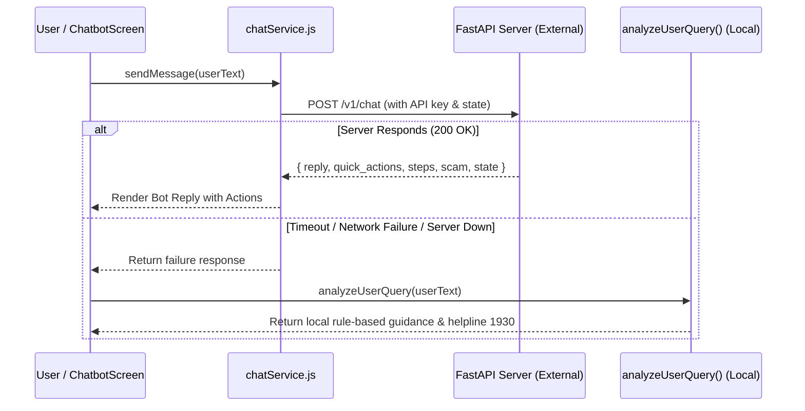
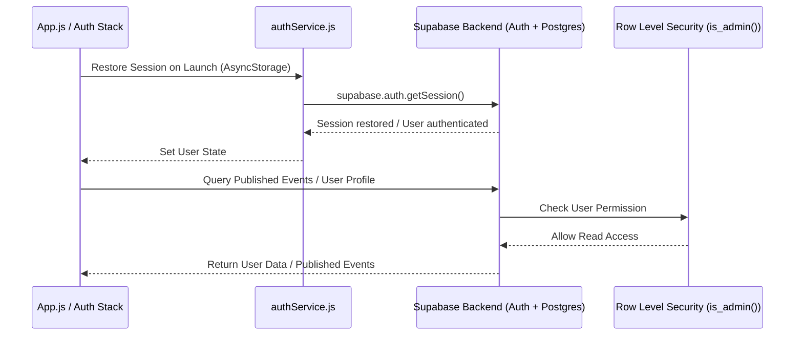

# CyberAkshak System Architecture

This document describes the navigation structure, data flow, component hierarchy, and service integrations of the CyberAkshak React Native application.

---

## 🗺️ 1. Navigation Tree

CyberAkshak utilizes `@react-navigation/native-stack` combined with `@react-navigation/bottom-tabs`.

```mermaid
graph TD
    App[App.js] --> NavContainer[NavigationContainer]
    NavContainer --> StackNav[Stacknavigation]
    
    subgraph Auth Stack (Conditional when REQUIRE_AUTH & Signed Out)
        StackNav --> Welcome[WelcomeScreen]
        StackNav --> Login[LoginScreen]
        StackNav --> SignUp[SignUpScreen]
        StackNav --> VerifyOTP[VerifyOTPScreen]
        StackNav --> ForgotPassword[ForgotPasswordScreen]
        StackNav --> ResetPassword[ResetPasswordScreen]
    end

    subgraph App Stack (Main App)
        StackNav --> MainTabs[MainTabs / HomeBottomNav]
        StackNav --> Chatbot[ChatbotScreen]
        StackNav --> FraudEdu[FraudEducationScreen]
    end

    subgraph Main Bottom Tabs
        MainTabs --> HomeScreen[HomeScreen]
        MainTabs --> NewsScreen[NewsScreen]
        MainTabs --> EventsScreen[EventsScreen]
        MainTabs --> ProfileScreen[ProfileScreen]
    end
```

---

## 📊 2. Screen-by-Screen Data Flow & Sources

| Screen Name | Description | Primary Data Source | Secondary / Fallback Data Source |
| :--- | :--- | :--- | :--- |
| **HomeScreen** | Main dashboard with brand topbar, quick action shortcuts, threat scanner card, horizontal fraud guides preview, and tip of the day. | Static data in `src/constants/data.js` (`QUICK_ACTIONS`, `FRAUD_CATEGORIES`). | Active user profile state from Supabase Auth / `profiles` table. |
| **NewsScreen** | Live cybersecurity news feed, alert banners, and article detail modal. | External RSS / News API via `src/services/newsApi.js`. | Hardcoded verified advisory alerts if network request fails. |
| **EventsScreen** | Cyber safety events, workshops, webinars listing, and category filters. | Supabase PostgreSQL database `events` table via `src/services/eventsService.js`. | Local bundled `UPCOMING_EVENTS` dataset in `src/constants/data.js` when offline. |
| **FraudEducationScreen** | Detailed fraud category guides, red flag lists, prevention steps, and emergency action plans. | Static dataset `FRAUD_CATEGORIES` in `src/constants/data.js`. | None. |
| **ChatbotScreen** | Conversational threat assessment assistant with step-by-step guidance and action buttons. | External FastAPI Chatbot endpoint via `src/services/chatService.js`. | Local intelligent query parser `analyzeUserQuery()` in `src/constants/data.js` if server is unreachable. |
| **ProfileScreen** | User details, account settings, language selection, dark theme toggle, profile editing, and sign-out. | Supabase `profiles` table row corresponding to `auth.users.id`. | AsyncStorage local persistent session. |

---

## 🔄 3. Service Interactions & Data Flow Diagrams

### Chatbot Interaction Architecture


### Database & Auth Architecture (Phase 2 Target)

