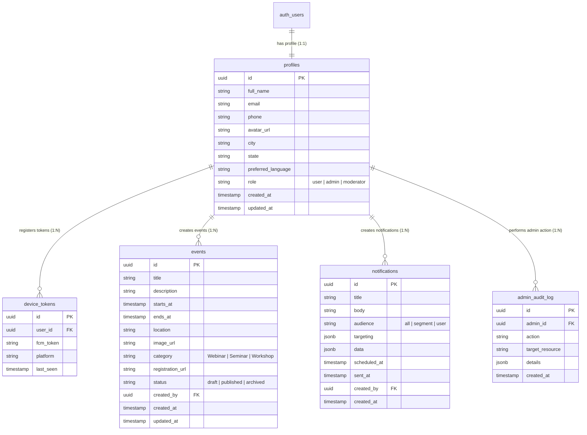

# CyberAkshak Database Documentation

This document describes the PostgreSQL database schema, entity relationships, Row Level Security (RLS) policies, and administrative query procedures for CyberAkshak.

---

## 📊 1. Entity Relationship Diagram (ERD)



---

## 🔒 2. Table Specifications & Row Level Security Policies

### `profiles`
- **Purpose**: Stores extended user profiles linked directly to `auth.users.id`.
- **Role Control**: `role` column defaults to `'user'`. Trigger `prevent_role_self_update` prevents non-admins from changing their own role.
- **RLS Policies**:
  - `Profiles read policy`: Users can read their own profile (`id = auth.uid()`) OR admins can read all profiles.
  - `Profiles update policy`: Users can update their own profile fields (`full_name`, `phone`, `city`, `state`, `avatar_url`, `preferred_language`) OR admins can update any profile.

### `events`
- **Purpose**: Lists cyber awareness events, webinars, and training workshops.
- **RLS Policies**:
  - `Events public read published`: Anyone (including guests/mobile app users) can read published events (`status = 'published'`). Admins can read all (`draft`, `published`, `archived`).
  - `Events admin insert/update/delete`: Admins only, validated by `is_admin(auth.uid())`.

### `notifications`
- **Purpose**: Admin broadcast and targeted push notification campaigns.
- **RLS Policies**:
  - `Notifications read policy`: Users can read notifications targeted to all (`audience = 'all'`) or matching their user ID. Admins can read all.
  - `Notifications admin insert/update`: Admins only.

### `device_tokens`
- **Purpose**: Stores active Firebase Cloud Messaging (FCM) tokens per registered user device.
- **RLS Policies**:
  - `Device tokens user select/insert/update/delete`: Users can view and manage only their own device tokens (`user_id = auth.uid()`).

### `admin_audit_log`
- **Purpose**: Immutable security log recording every administrative operation.
- **RLS Policies**:
  - `Audit log admin select/insert`: Admins only.

---

## 👑 3. How to Promote the First Admin User

To promote a registered user to the `admin` role, run the following SQL command in your Supabase SQL Editor:

```sql
-- Replace 'user@example.com' with the exact registered user email
UPDATE public.profiles
SET role = 'admin'
WHERE email = 'user@example.com';
```

Alternatively, by User UUID:

```sql
UPDATE public.profiles
SET role = 'admin'
WHERE id = 'USER_UUID_HERE';
```

---

## 🧪 4. RLS Verification Queries

To test that RLS policies are working:

```sql
-- 1. Test reading published events (Should return rows for normal users):
SELECT * FROM public.events WHERE status = 'published';

-- 2. Test inserting event as a normal user (Should FAIL with RLS policy violation):
INSERT INTO public.events (title, description, starts_at)
VALUES ('Unauthorized Event', 'Test', NOW());

-- 3. Test attempting to elevate self to admin (Should FAIL with exception):
UPDATE public.profiles
SET role = 'admin'
WHERE id = auth.uid();
```
